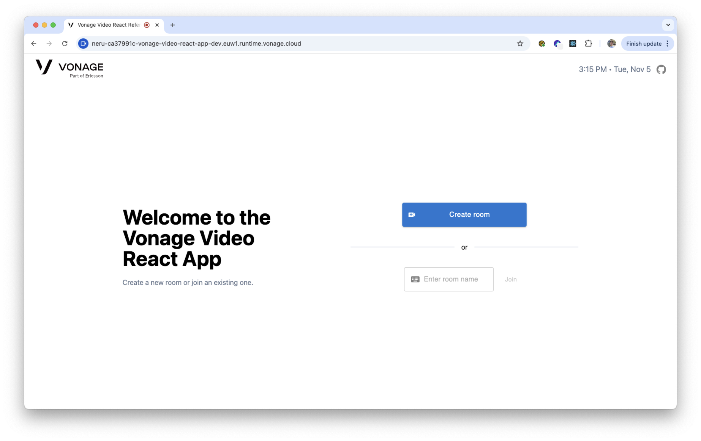
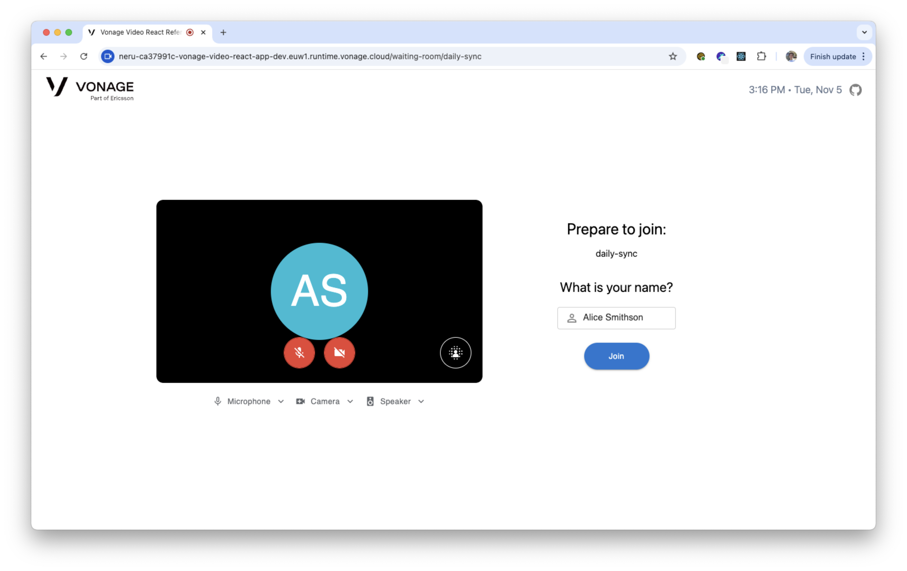
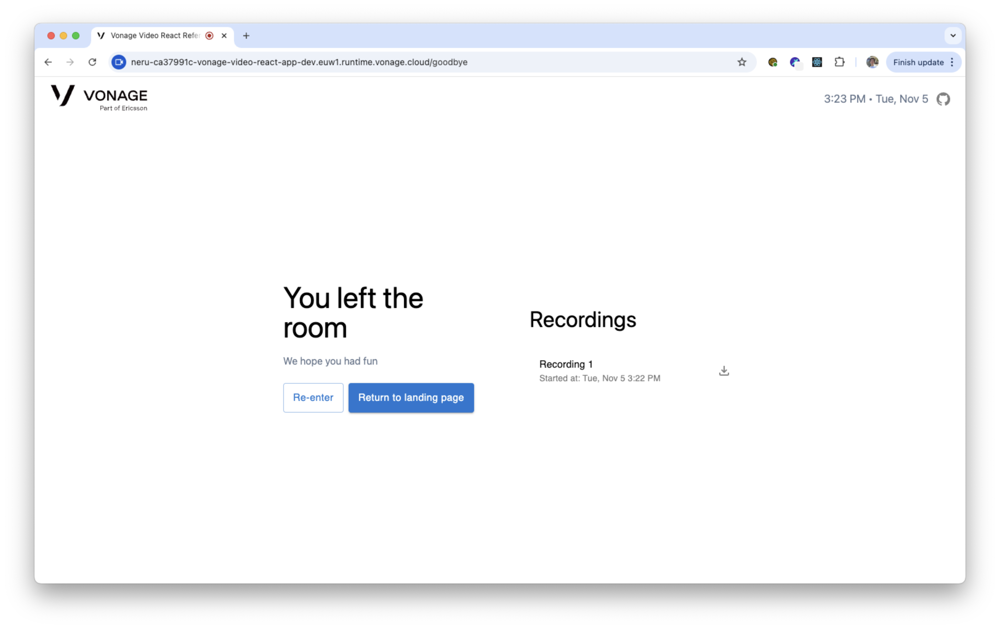
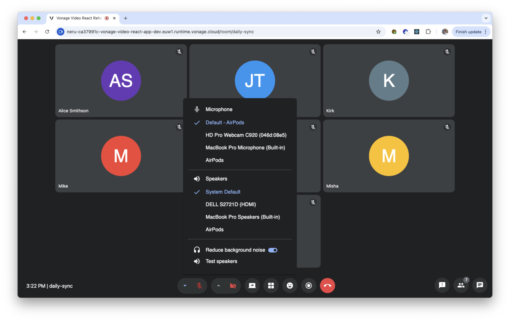
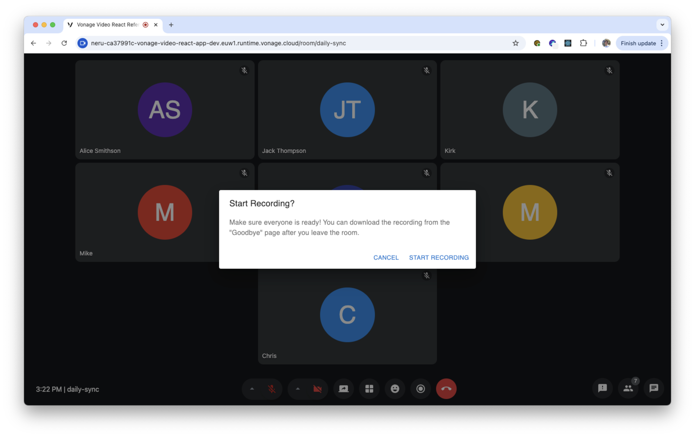
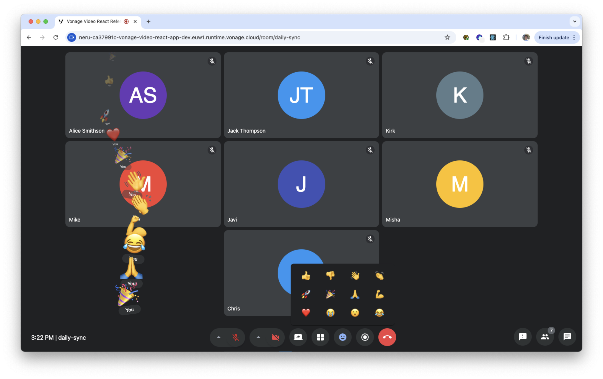
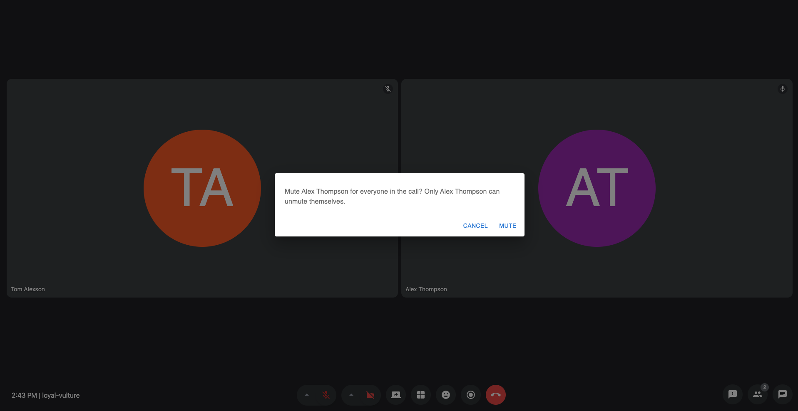
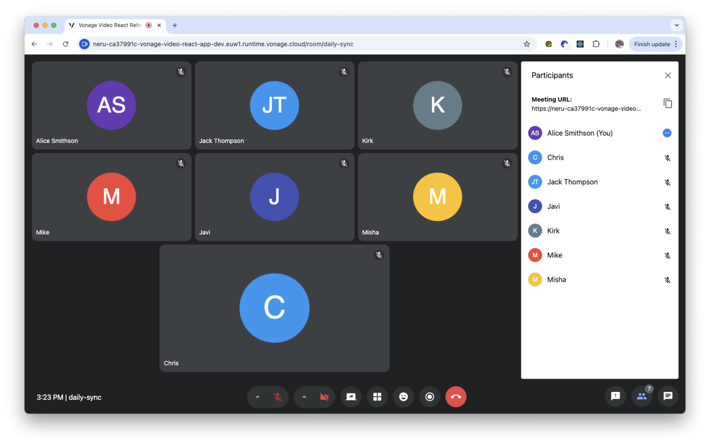
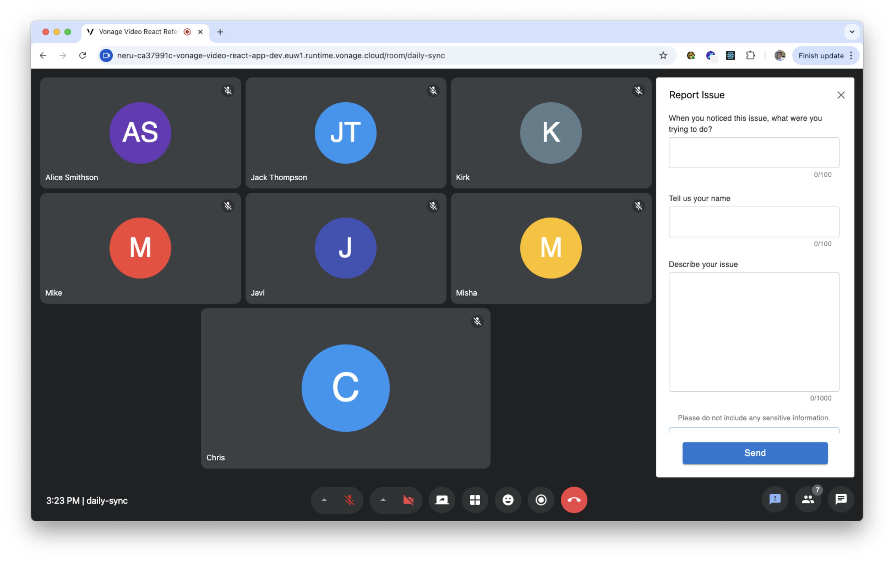
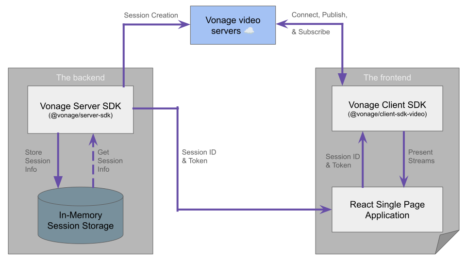

# Vonage Video API Reference App for React

## Table of Contents
<!-- TOC -->

- [Table of Contents](#table-of-contents)
- [What is it?](#what-is-it)
- [Why use it?](#why-use-it)
- [Project Architecture](#project-architecture)
- [Platforms Supported](#platforms-supported)
- [Requirements](#requirements)
- [Running Locally](#running-locally)
  - [Config](#config)
  - [Running the project](#running-the-project)
    - [Installing dependencies](#installing-dependencies)
    - [Dev mode](#dev-mode)
    - [Production mode](#production-mode)
- [Deployment to Vonage Cloud Runtime](#deployment-to-vonage-cloud-runtime)
- [Testing](#testing)
  - [Integration Tests](#integration-tests)
    - [Screenshot tests or Visual comparisons](#screenshot-tests-or-visual-comparisons)
    - [Generating and Updating Screenshots](#generating-and-updating-screenshots)
  - [Running the backend and frontend test suites](#running-the-backend-and-frontend-test-suites)
  - [Backend Suite](#backend-suite)
  - [Frontend Suite](#frontend-suite)
- [Code style](#code-style)
  - [Linting and auto-formatting](#linting-and-auto-formatting)
  - [File names](#file-names)
- [Documentation Generation](#documentation-generation)
- [Code of Conduct](#code-of-conduct)
- [Getting Involved](#getting-involved)
- [Known Issues](#known-issues)
- [Report Issues](#report-issues)

<!-- /TOC -->
## What is it?
The Vonage Video API Reference App for React is an open-source video conferencing reference application for the [Vonage Video API](https://developer.vonage.com/en/video/client-sdks/web/overview) using the React framework.

The Reference App demonstrates the best practices for integrating the [Vonage Video API](https://developer.vonage.com/en/video/client-sdks/web/overview) with your application for various use cases, from one-to-one and multi-participant video calling to recording, screen sharing, reactions, and more.

## Why use it?
The Vonage Video API Reference App for React provides developers an easy-to-setup way to get started with using our APIs with React.

The application is open-source, so you can not only get started quickly, but easily extend it with features needed for your use case. Any features already implemented in the Reference App use best practices for scalability and security.

As a commercial open-source project, you can also count on a solid information security architecture. While no packaged solution can guarantee absolute security, the transparency that comes with open-source software, combined with the proactive and responsive open-source community and vendors, provides significant advantages in addressing information security challenges compared to closed-source alternatives.

This application provides features for common conferencing use cases, such as:

- <details>
    <summary>A landing page for users to create and join meeting rooms.</summary>
    
  </details>
- <details>
    <summary>A waiting room for users to preview their audio and video device settings and set their name before entering a meeting room.</summary>
    
  </details>
- <details>
    <summary>A post-call page to navigate users to the landing page, re-enter the left room, and display archive(s), if any.</summary>
    
  </details>
- A video conferencing “room” supporting up to 25 participants and the following features:
- <details>
    <summary>Input and output device selectors.</summary>
    
  </details>
- Background blur and noise suppression toggles.
- <details>
    <summary>Composed archiving capabilities to record your meetings.</summary>
    
  </details>
- <details>
    <summary>In-call tools such as screen sharing, group chat function, and emoji reactions.</summary>
    
  </details>
- Active speaker detection.
- Layout manager with options to display active speaker, screen share, or all participants in a grid view.
- The dynamic display adjusts to show new joiners, hide video tiles to conserve bandwidth, and show the “next” participant when someone previously speaking leaves.
- <details>
    <summary>Ability to mute other participants during the meeting.</summary>
    
  </details>
- <details>
    <summary>Call participant list with audio on/off indicator.</summary>
    
  </details>
- Meeting information with an easy-to-share URL to join the meeting.
- <details>
    <summary>A reporting tool to enable participants to file any in-call issues.</summary>
    
  </details>

## Project Architecture



## Platforms Supported
The Vonage Video API Reference App for React is currently supported on the latest release versions for the following browsers:
-  Google Chrome
-  Firefox
-  Microsoft Edge
-  Opera
-  Safari
-  Electron

*Note:* Mobile web views have limited supported at the moment.

## Requirements


- [node.js](https://nodejs.org/en/download/releases/) (version 22)
- [yarn](https://yarnpkg.com)
- optional - [nvm](https://github.com/creationix/nvm) (recommended for switching Node versions)

## Running Locally

### Config

 In project directory, create the environment variables for the project.

```console
cp backend/.env.example backend/.env
```
[Click here](backend/.env.example) to learn more about config variables used in the backend.

Add your Vonage Video API credentials to the newly created .env file.

```console
cp frontend/.env.example frontend/.env
```
[Click here](frontend/.env.example) to learn more about config variables used in the frontend.

### Running the project

#### Installing dependencies

```console
yarn
```
This command installs all appropriate dependencies for the project. If you would like more information on the packages we use, please refer to the [Dependencies](./docs/DEPENDENCIES.md) document.

#### Dev mode

```console
yarn dev
```

This command builds and watches both the backend server (:3345) and frontend vite dev server (:5173)
You should now see the app running at [http://localhost:5173/](http://localhost:5173/)

#### Production mode

This command builds a production bundle of the app frontend and `cp`s it to the backend to be served by the express server.

```console
yarn start
```

The app and API are both served on  [http://localhost:3345/](http://localhost:3345/)

## Deployment to Vonage Cloud Runtime

You can easily deploy your local branch to Vonage Cloud Runtime (VCR) using the tools in this repository. See https://developer.vonage.com/en/vonage-cloud-runtime/overview for an overview of Vonage Cloud Runtime.

Firstly, install the VCR cli: https://developer.vonage.com/en/vonage-cloud-runtime/getting-started/working-locally#cli-installation.

Run `vcr configure` entering your Vonage API Key and Secret, and select a region. You can find your API key and secret on the dashboard: https://dashboard.nexmo.com/.

Now run `vcr init` and follow the steps to:
1. choose a project name
2. choose an instance name
3. select `nodejs22` for the runtime
4. Select a region for your app
5. Choose or create an application for deployment. :warning: You should use a separate Vonage application to your Vonage Video application (i.e. the value you used for `VONAGE_APP_ID` in the `backend/.env` file) to avoid issues with your private key
6. Choose an application for debug, if you SKIP it will re-use the application from your deployment
7. For the product template select SKIP

You will see a new file created `./vcr.yml`. This file is ignored by git so that each developer can have their own deployment setup locally. This file is still missing the `entrypoint` and `build-script` fields which you can copy and paste from `./vcr.yml.example`.

Your file should now look something like this:
```yaml
project:
  name: my-project-name
instance:
  name: my-instance-name
  runtime: nodejs22
  region: aws.euw1
  build-script: './vcrBuildLocal.sh'
  entrypoint: [yarn, run-server]
  application-id: my-deployment-app-id
debug:
  entrypoint: [yarn, run-server]
  application-id: my-debug-app-id
```

Now run `yarn deploy-vcr` to deploy your project.
After a successful deployment the url of you instance will be shown in the output as 'Instance host address'.
You can also check your instances at https://dashboard.nexmo.com/serverless/instances.

Note: This will deploy the project using your local code and .env files, which is useful for debugging.
For a more centralized deployment to VCR see our GHA workflow `.github/workflows/deploy-to-vcr.yml`.

## Testing

### Integration Tests

We have integration tests using [Playwright](https://playwright.dev/). We recommend using their [VSCode integration](https://playwright.dev/docs/getting-started-vscode) to run tests.

To run the tests you need to run the app server separately:

```console
# In one terminal tab
yarn start

# In a separate tab. Or use vscode extension to run tests
yarn test:integration
```

#### Screenshot tests or Visual comparisons

We use [Playwright Visual Comparison](https://playwright.dev/docs/test-snapshots) for Screenshot UI tests. Since screenshot tests are part of our integration tests, running our integration tests also executes the screenshot tests.

#### Generating and Updating Screenshots

If we need to update the expected screenshot due to UI changes, we can delete the existing expected screenshot and then run the test. The test will fail, but a new expected screenshot will be generated. Running the test again should pass, as the expected and actual screenshots will now match.

For CI tests, we require screenshots for various browsers and operating systems because they [render interfaces with subtle differences](https://github.com/microsoft/playwright/issues/18240#issuecomment-1287546463).

To capture CI-specific screenshots, you can use the `update-screenshots` job. This job is triggered by creating a pull request (PR) with the `update-screenshots` label on GitHub. Once triggered, it will capture new screenshots on the virtual machine (VM) and automatically push those to the PR's branch.

### Running the backend and frontend test suites

- To run the frontend and backend tests:
```console
yarn test
```

### Backend Suite

- To run backend tests once:

```console
yarn test:backend
```

- To run backend tests in watch mode (ie you're adding more tests):

```console
yarn test:backend:watch
```

- For additional CLI options, see [jest docs](https://jestjs.io/docs/cli).

### Frontend Suite
We have frontend tests using [vitest](https://vitest.dev/) and [React Testing Library](https://testing-library.com/docs/react-testing-library/intro). We recommend using the [vitest VSCode integration]( https://marketplace.visualstudio.com/items?itemName=vitest.explorer) to run tests.

Alternatively you can run the tests in the terminal:
- To run frontend tests once:

```console
yarn test:frontend
```

- To run frontend tests in watch mode (ie you're adding more tests):

```console
yarn test:frontend:watch
```

- For additional CLI options, see [vitest docs](https://vitest.dev/guide/cli#options)

## Code style

### Linting and auto-formatting
We use eslint and prettier to format code. Prettier issues will show up in eslint too via eslint-plugin-prettier.
You can setup an eslint extension for your editor. For VSCode use: [dbaeumer.vscode-eslint](https://marketplace.visualstudio.com/items?itemName=dbaeumer.vscode-eslint).

You can either set up vscode to fix eslint issues on save or fix them with VSCode keyboard command palette shortcut `cmd + shift + p > "ESLint: Fix all auto-fixable problems"`.

In the terminal you can run

```console
yarn lint
```

to check for eslint issues and

```console
yarn lint:fix
```

to fix any auto-fixable issues and also run prettier on all files.

### File names

All filenames are in `camelCase`.

## Documentation Generation

We use `typedoc` to generate documentation from our jsdoc comments.
Generated documents can be found in the `frontend/dist` folder.

To generate documentation, run the following in the terminal

```console
yarn docs
```

## Code of Conduct

Please read our [Code of Conduct](CODE_OF_CONDUCT.md).

## Getting Involved

If you wish to contribute to this project, read how in [Contributing](./docs/CONTRIBUTING.md).

## Known Issues

We track known issues in [Known Issues](./docs/KNOWN_ISSUES.md). Please refer to it for details.

## Report Issues

If you have any issues, feel free to open an issue or reach out to support via [support@api.vonage.com](support@api.vonage.com).
